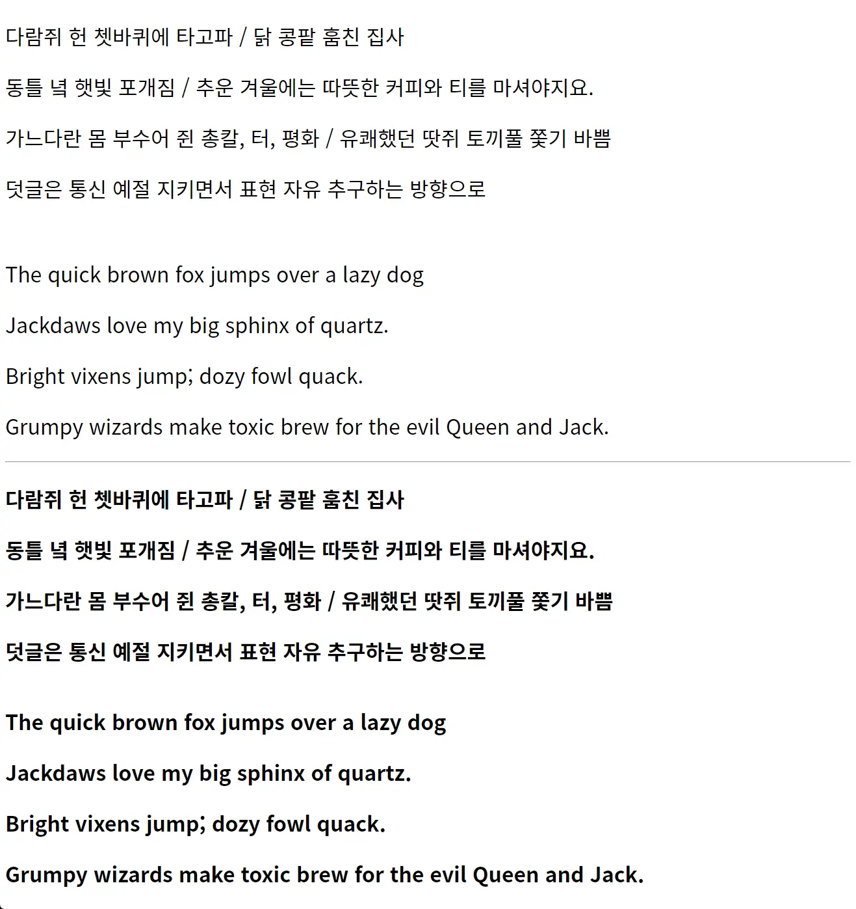

# NotoSansKR-subset
Google Font가 있지만, 개인적인 취향으로 인해 서브셋을 만들고 쓰기로 했습니다. 간혹 Google Font에 접속이 안되는 경우도 있더라고요. 뭐, 이런거 하나정도 있어도 나쁠 것 없겠지요.

## 사용법
먼저 파일들을 적당한 자리에 넣어준 후 둘 중 한가지 방법으로 추가하시면 됩니다.
```html
<link href="/path/to/NotoSansKR-subset-local.css" rel="stylesheet">
```
```css
@import url('/path/to/NotoSansKR-subset-local.css');
```
웹폰트 파일들을 서버에 둘 수 없다면 jsDelivr를 사용할 수도 있습니다.
```html
<link href="//cdn.jsdelivr.net/gh/TetraTheta/NotoSansKR-subset/dist/style/NotoSansKR-subset-web.css" rel="stylesheet">
```
```css
@import url('//cdn.jsdelivr.net/gh/TetraTheta/NotoSansKR-subset/dist/style/NotoSansKR-subset-web.css');
```
이후 `font-family`에서 `NotoSansKR-subset`을 사용하시면 됩니다.

## 포함되어 있는 글자들
자세한 정보는 [웹폰트 서브셋용 글리프 모음 README](https://github.com/TetraTheta/WebfontSubset-glyphs/blob/main/README.md)를 참조하세요.

## 용량 감소
원본 파일(OTF)와 비교해서 WOFF/WOFF2가 얼마나 줄어들었냐면...

* NotoSansKR-Regular: 15.6MB → 479KB(WOFF) / 419KB(WOFF2)
* NotoSansKR-Bold: 16.2MB → 492KB(WOFF) / 434KB(WOFF2)

## 원본 라이선스
원본 폰트인 [Noto Sans](https://fonts.google.com/noto/specimen/Noto+Sans+KR/about) 폰트는 [Open Font License](https://scripts.sil.org/cms/scripts/page.php?site_id=nrsi&id=OFL)하에 배포되었습니다.

## 미리보기

